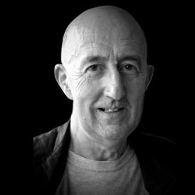

+++
title = "In Memoriam: Alan Thomas Ruddock  (10 Jan 1944 – 2 Apr 2012)"
author = "Saket K"
date = 2013-04-02T16:12:00+02:00
categories = ["martial arts"]
tags = ["reflection","personal","in memoriam"]
series = []
summary = "A reflection on passing of my Aikido instructor who was a great inspiration to me."
+++

Today marks the one year anniversary of Alan Ruddock's passing. 

Alan was a remarkable man: soft-spoken, intelligent, full of good humor and with a kind word to say to anyone he encountered in his path through life. He was the sort of man I hallucinate I am on days when I feel particularly good about myself. It's rare to find an inspiration, a role model, even a hero, at my age, but Alan was that and more to me. I really feel blessed to have known him so well.

Alan Ruddock lived a rich life, despite his death at the far too young an age of 68, and the many details and anecdotes of that life could fill several memorial texts. There are several places you can go to read up about him that have fortunately been published in recent years. He was one of the first Irish karateka, and his experiences studying this art as a young man can be found in Dr. Clive Layton's work [Shotokan Dawn over Ireland](http://www.cyberbudo.com/cyberbudo/publications.php).

Later, he became one of the first to pioneer the art of Aikido in Ireland and, in his search to understand this less known Japanese martial art, he eventually travelled to Japan in the 1960s to train with the founder of Aikido: Morihei Ueshiba.

I've spent hours listening to him relate tales of the hijinx he got up to there until it felt like I would burst my sides with laughter. Alan was quite the raconteur and could keep a room chuckling at the strange turns and fortunes his life had taken with a well-placed, if softly spoken, punchline. You can get a sense of this tone, and a whole sampling of great stories, from a book he wrote just a few years ago entitled: [Aikido Memoirs: One Irishman's lifetime search for the answer to the mystery of Morihei Ueshiba's Aikido](http://www.lulu.com/shop/alan-ruddock/aikido-memoirs-rev-2/paperback/product-15764294.html)

The first time I met Alan, he'd come to the Netherlands to give an Aikido seminar at the dojo I was training at then. I'd been searching for years for a physical expression of some esoteric principles I'd been studying and it wasn't until I saw Alan move that I believed I was getting close. There was an elegant simplicity to every movement, a clear logic to the ideas expressed in his martial arts. A whole world of possibilities opened up to me. One of the things that became apparent was that reaching a level of skill like people claimed the founder of Aikido possessed wasn't just a matter of training hard for 60 years. It required you to be practicing the right thing. As I had suspected, a lot of the painful joint-locking and static grappling I had been training for years wasn't going to get me closer to an 'effortless' Aikido. With just a class or two, Alan had already shaken me awake and changed the course of my training.

But it's on the personal front that Alan had the most profound effect on me. I had met other big shots in the martial arts world before. They came with retinues and there were complicated, unwritten rules about how to approach them and get an audience with them. Alan just walked jovially about the mat, talking to everyone, whether beginner or advanced, gently pointing out areas for improvement, joking and smiling until the entire class relaxed and got on with training. He insisted we address him by first name, instead of the more formal sensei, or shihan, as our more formalistic instructor would have had it. There was never a moment when he was not patient or ready to help.

If I thought this would change off the Aikido mat, it didn't. Alan was always true to his core in everything he did, bringing the same easy smile and camaraderie to life that he did to training. Despite his many accomplishments he was always a down-to-earth kind of person, just as comfortable talking to little kids as to the 'rougher' types he would occasionally encounter in his wanderings as a teacher. And everyone seemed to take to him in the same way, surprised at the fact that he was so accessible, delighted by his stories of hunting for hamburgers in 1960s Tokyo, and fascinated by the richness of his martial arts knowledge.

It's the way he treated people, the basic sense of fairness, decency and friendliness that touched me most strongly. Alan never claimed to be a spiritual master, this wasn't his thing and I won't posthumously elevate him to such a position (he'd be mortified). But he was certainly an example to me, and I think he was the same to a lot of the people who knew him. Whenever I feel my temper flaring, a quick thought of Alan grinning and telling me to 'smile' is enough to cool me down. Any time I find myself getting too judgmental, a thought to how he was able to accept everyone on an equal footing is an inspiration I'm happy to emulate. And any time I feel attacked, remembering the speed and implacable boldness of Alan's responses strengthen me too.

For all his affability, there was nothing doubtful or hesitant in Alan's martial arts. He was solid right out to the ends of his toes and I can remember many of us flying through the air with a comical look of shock when we playfully tried to 'surprise' him on the mats. Without using any force, Alan was sharp, quick and unerring. There was a sense that he would go for your jugular when he moved that kept you on your toes when training with him. I always felt perfectly safe because I knew who he was, but I certainly was not planning on getting into any arguments with him! Like many martial artists of a certain generation, Alan had his share of Japanese bar brawl stories and adventures on the underground, but he always laughed off our attempts to get him to elaborate further by grounding us in reality. "You've got to watch out your eyes," he'd say,"and take everything in. If you see trouble coming, cross over to the other side of the street."

Towards the end of his life, Alan started to suffer from a neurodegenerative ailment that made it difficult for him to control his fingers and hands, and other motor skills started to suffer. He still continued to hold seminars however and was able to instruct us with a great deal of energy and flair, bringing his indomitable will to bear where another might well have decided to retire.

He was returning from a seminar in Cork, Ireland, when he took ill and after a night in the hospital in Dublin, passed away a year ago today.

I had very much hoped to have much more time with Alan before he went and his passing, while not unexpected, left a void in my world that will likely not be filled again. In some respects, it may have been a mercy he went so quickly, instead of undergoing the slow, difficult process his illness may have put him through. It's only out of the selfishness of someone who misses a friend and a teacher greatly that I wish he'd tarried longer.

Rest In Peace, Alan.
