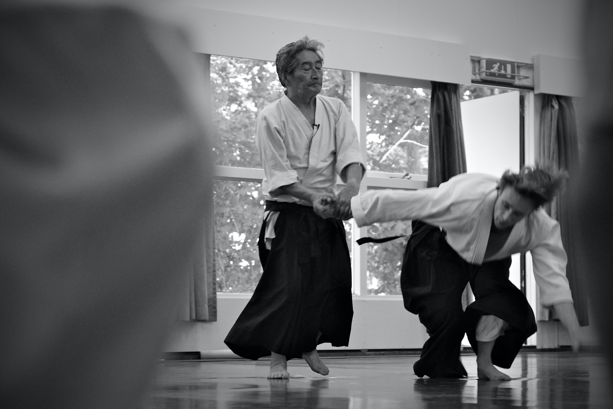

+++
title = "In Memoriam: Henry Yoshiaki Kono (August 24, 1927 – February 13, 2016)"
author = "Saket K"
date = 2016-04-13T16:12:00+02:00
categories = ["martial arts"]
tags = ["reflection","personal","in memoriam"]
series = []
summary = "A reflection on passing of a man who shifted the foundation of my martial arts."
+++

To me, Henry was a force of nature.

At less than two-thirds my height, but with twice my presence, Henry could be gentle as the first flurries of Canadian snow or as ferocious as a tiger protecting her cubs. His ferocity expressed itself in the intense focus he could bring into the practice of his art, Aikido. In the way he practiced it, it is an art encompassing all the complexity and paradoxical simplicity of the Taoist principles of Yin and Yang. Expressed in motion it is graceful like a dance, but it requires a martial discipline of mind, a fierce determination to remain focused in the present moment, for it to be executed with such fluidity that it appears to be choreographed.

None of us, his students, quite got that last part right and we're working hard on it until this day.

Like all the Zen stories of seeking enlightenment, Henry's approach to Aikido can be grasped in an instant if you see it, but might never be chased and pinned down regardless of years of intensive practice. As it is with Yin and Yang, there is nothing more concrete yet nothing more ephemeral.

This is not to say we will give up: awareness that a thing is possible is already a large part of the battle. Until I met Henry, I never quite understood how someone could be 'thrown' without feeling any force or even truly understanding afterward what had happened. It isn't magic even though it is magical: just like the laws of nature that allow a flower to blossom aren't magic, but the result is spectacular.

With these kinds of heady thoughts and deeply philosophical (if not spiritual) ideas constantly stirred up in us as we were trying to understand what Henry was explaining to us, the practice of Aikido became not only a physical activity but one of true, moving meditation. What was happening in your mind and, more specifically, in your attention, made all the difference to the outcome. It took a certain introspective, no-nonsense frame of mind to see the value of what Henry was teaching and many people scratched the surface and then dismissed it. I'm not saying that Henry held some form of gospel truth, just that what he was teaching was deeply valuable and I believe understanding it would enrich you in ways you may not fully understand until you're much farther down that path.

It's not strange that the group we formed was eclectic with people hailing from different corners of the world: Canada, the U.S., Ireland, Holland, Israel, France, Poland to name but a few. And this is where I found the true value of what Henry was teaching us, despite our differing backgrounds and belief structures, or the differences in our cultures, there was a simple, open acceptance of people as they were. Just as, on the mat, we were practicing to blend with our training partner and to leave their movement undisturbed, so too was it normal that we accepted newcomers to the group and left them as they were.

And yet, by interacting with each other, we all changed together so that we became a tight-knit unity rather than a rag-tag band of martial artists.

I'm not claiming this is a unique circumstance, this kind of bonding is common with any group engaged in intensive interaction with each other, but it is rare to see the same principle of harmony and unity, integrated from the level of individual movements and training, up through the mindset of the practitioners, and into the very group dynamic.

# Links

- [Henry Kono's Online Memorial](http://mcdbrownscarborough.sharingmemories.ca/site/Henry-Kono.html?s=40)
- [A wonderful obituary by Fiona Mc Auley](https://www.facebook.com/notes/fiona-mc-auley/henry-kono-ar-shl%C3%AD-na-fir%C3%ADnne/10153983355543385/)
